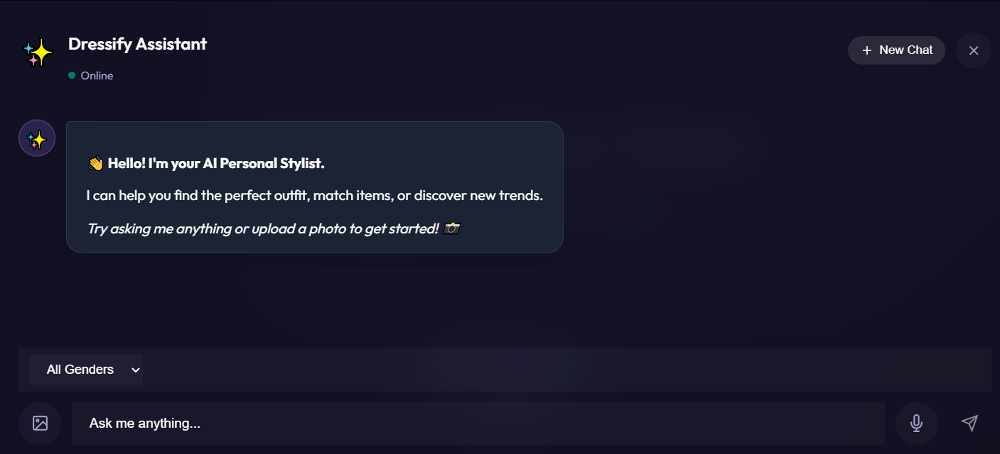

# Fashion AI Chatbot 🎨

An AI-powered fashion search chatbot with image recognition, natural language understanding, and smart outfit recommendations. Built with FastAPI backend and an embeddable frontend widget.

## ✨ Features

- **Smart Text Search**: Natural language queries for fashion items
- **Image Search**: Upload images to find visually similar items using CLIP
- **Voice Interaction**: Speech-to-Text support using Whisper for voice queries
- **Outfit Recommendations**: Complete outfit suggestions for any occasion
- **Gender-Aware**: Intelligent gender detection for relevant results
- **Embeddable Widget**: Easy to add to any website

## 📸 Screenshots



## 🏗️ Architecture

```
┌─────────────────┐     ┌─────────────────┐
│   Frontend      │────▶│   Backend       │
│   (Port 3000)   │     │   (Port 8000)   │
│                 │     │                 │
│  - Express      │     │  - FastAPI      │
│  - Widget UI    │     │  - LangGraph    │
│  - Magic CSS    │     │  - Whisper STT  │
│                 │     │  - CLIP & FAISS │
│                 │     │  - Gemini API   │
└─────────────────┘     └─────────────────┘
```

## 📋 Prerequisites

- Python 3.10+
- Node.js 18+
- Google Gemini API key
- ffmpeg (required for audio processing)

## 🚀 Quick Start

### 1. Clone and Setup

```bash
cd d:\projects\NTI_FP1

# Backend setup
cd backend
pip install -r requirements.txt
cp .env.example .env
# Edit .env and add your GEMINI_API_KEY

# Frontend setup
cd ../frontend
npm install
cp .env.example .env
```

### 2. Configure Environment

Edit `backend/.env`:
```
GEMINI_API_KEY=your_api_key_here
BACKEND_PORT=8000
```

### 3. Run Both Servers

**Option A: Using run.sh (Linux/Mac/Git Bash)**
```bash
./run.sh
```

**Option B: Manually**

Terminal 1 (Backend):
```bash
cd backend
uvicorn app.main:app --reload --port 8000
```

Terminal 2 (Frontend):
```bash
cd frontend
npm start
```

### 4. Open in Browser

- **Frontend**: http://localhost:3000
- **Backend API Docs**: http://localhost:8000/docs

## 📖 API Endpoints

| Endpoint | Method | Description |
|----------|--------|-------------|
| `/api/health` | GET | Health check |
| `/api/search` | POST | Search with text/image |
| `/images/{id}` | GET | Get product image |

### Search Request Example

```bash
# Text search
curl -X POST http://localhost:8000/api/search \
  -F "text_query=blue jeans"

# Image search
curl -X POST http://localhost:8000/api/search \
  -F "image=@path/to/image.jpg"

# Hybrid search
curl -X POST http://localhost:8000/api/search \
  -F "text_query=similar shirt" \
  -F "image=@path/to/pants.jpg"
```

## 🔗 Embedding on Your Website

Add this script tag to any HTML page:

```html
<script src="http://localhost:3000/embed.js"></script>
```

The chatbot icon will appear in the bottom-right corner.

## 📁 Project Structure

```
NTI_FP1/
├── backend/
│   ├── app/
│   │   ├── core/config.py       # Configuration
│   │   ├── models/schemas.py    # Pydantic models
│   │   ├── routers/search.py    # API endpoints
│   │   ├── services/
│   │   │   ├── agents/          # AI agents (Search, Response, etc.)
│   │   │   ├── workflow.py      # LangGraph workflow
│   │   │   └── llm_service.py   # LLM initialization
│   │   ├── utils/
│   │   │   ├── embeddings.py    # CLIP embeddings
│   │   │   └── faiss_manager.py # Vector database
│   │   └── main.py              # FastAPI app
│   ├── saved_audio/             # Temp audio storage
│   ├── vector_db/               # Saved FAISS index
│   └── requirements.txt
├── frontend/
│   ├── public/
│   │   ├── index.html
│   │   ├── styles.css           # Magic UI
│   │   └── script.js            # Widget logic
│   ├── embed.js                 # Embeddable script
│   └── server.js                # Express server
├── data/
│   ├── styles.csv               # Product catalog
│   └── images/                  # Product images
└── README.md
```

## 🤖 AI Pipeline

1. **Image Validator**: CLIP validates if image is fashion-related
2. **Image Description**: Extracts fashion attributes from image
3. **Intent Classifier**: Determines user intent (search/greeting/etc)
4. **Query Understanding**: Gemini generates search queries with gender awareness
5. **Search Executor**: FAISS similarity search with gender filtering

## ⚙️ Configuration

Key settings in `backend/app/core/config.py`:

| Setting | Default | Description |
|---------|---------|-------------|
| `CLIP_MODEL` | `patrickjohncyh/fashion-clip` | Fashion CLIP model |
| `GEMINI_MODEL` | `gemini-2.0-flash-lite` | Gemini model |
| `TEXT_WEIGHT` | 0.30 | Text weight in hybrid search |
| `IMAGE_WEIGHT` | 0.70 | Image weight in hybrid search |

## 🐳 Docker (Optional)

```bash
docker-compose up -d
```

## 📝 Example Queries

- "blue jeans" - Find blue jeans
- "wedding outfit for men" - Men's formal wear
- "party dress for women" - Women's party dresses
- "casual summer outfit" - Both genders casual wear
- Upload an image - Find visually similar items

## 🔧 Troubleshooting

**Backend not starting?**
- Check GEMINI_API_KEY is set in .env
- Ensure data/styles.csv exists
- Check Python dependencies are installed

**Frontend not loading?**
- Ensure npm install completed
- Check backend is running on port 8000

**No search results?**
- FAISS index may need to build (first run takes time)
- Check vector_db/ folder has faiss_index.bin after first run

## � Team Members

- Abdullah Emara
- Ahmed Hassan
- Ahmed Yahia
- Enas Emad
- Aya Abdallah

## 📊 Dataset

We used the **Fashion Product Images (Small)** dataset from Kaggle for this project:
[Fashion Product Images (Small)](https://www.kaggle.com/datasets/paramaggarwal/fashion-product-images-small)

## �📄 License

MIT
